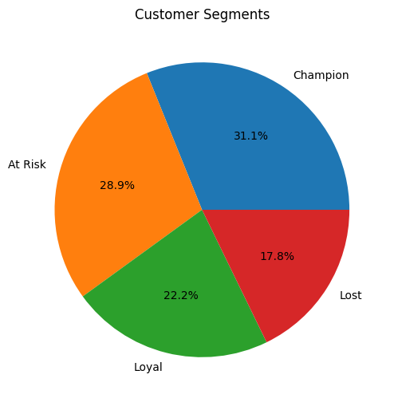
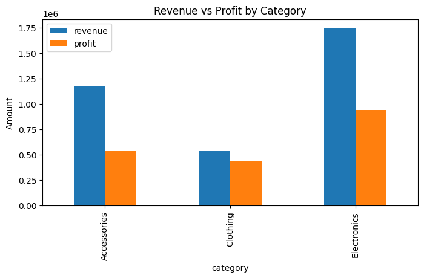
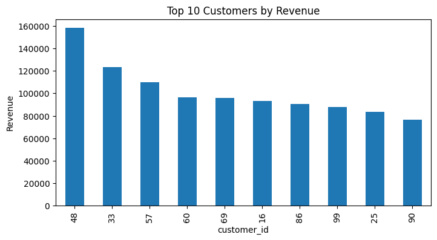

# Customer Purchase Behavior & Revenue Analysis

This project analyzes retail transaction data to understand how customers drive revenue and profit. I combined SQL and Python to clean data, engineer features like revenue and profit, and study sales trends over time. I performed RFM segmentation to classify customers into champions, loyal, at-risk, and lost groups, enabling targeted retention strategies. The analysis shows that a small portion of customers contributes most of the revenue, while some product categories generate higher profit despite lower sales volume. The project demonstrates end-to-end data analysis—from raw data to business recommendations—using realistic, production-style workflows.

## cutomer segement

## Revnue vs Profit by category

## Top 10 customer br revnue

### Analysis
This SQL file contains queries to perform key analyses on the retail data:
- Total revenue and profit calculation
- Monthly sales trend analysis
- Top 10 customers by revenue
- Revenue and profit breakdown by product category
- RFM (Recency, Frequency, Monetary) metrics for each customer

These queries can be run on a database containing the orders, order_items, products, and customers tables.

### Customer_Purchase_Behavior_&_Revenue_Analysis
This Jupyter notebook provides a comprehensive Python-based analysis of customer purchase behavior and revenue:
- Data generation and merging using pandas
- Exploratory data analysis with visualizations (monthly revenue trends, top customers, category performance)
- RFM analysis and customer segmentation
- Insights on revenue distribution and customer retention strategies

The notebook uses libraries like pandas, numpy, and matplotlib for data manipulation and plotting.

